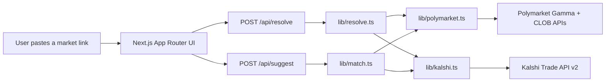

# Parity — a Polymarket ⇄ Kalshi explorer

**Live demo:** _add your Vercel URL here after deploying_
**Author:** [Michael Shih](https://github.com/smuushi)

## Why I built this

I'm applying to Polymarket's Software Engineer role on the US Exchange team. I already work at
[ChainPatrol](https://chainpatrol.io), where I'm one of the engineers behind the AI-powered comment
moderation service Polymarket runs today for community trust & safety — so I wanted to send
something that shows the kind of software I'd actually build there, not just talk about it.

Polymarket and Kalshi both run public, unauthenticated market-data APIs, but there's no easy way to
put the same real-world question side by side across both venues. Parity is a small, on-demand
explorer that does exactly that: paste a link, get an instant comparison — in the spirit of an
Etherscan or CoinMarketCap page, but for prediction markets.

## What it does

1. Paste a Polymarket or Kalshi market link.
2. The server resolves it against the platform's public API, normalizing price, volume,
   liquidity, spread, and resolution date into one shared shape.
3. It searches the other platform for the closest matching market by title similarity and
   category, and renders a ranked list of candidates.
4. You get a side-by-side comparison: implied probability gap, volume difference, and how far
   apart the two markets' resolution dates are — plus a 7-day price sparkline for each side.

You can also paste both links directly if you already know the exact pair you want to compare, or
switch between outcomes when a link resolves to a multi-outcome event (e.g. "World Cup Winner").

## Architecture



All third-party calls happen server-side (Next.js Route Handlers) to avoid CORS issues and add a
short cache window, since both APIs are public and rate-limit-sensitive.

### Matching, honestly

Neither platform's data schema knows about the other. Matching is a heuristic, not a guarantee:

- **Kalshi → Polymarket**: uses Polymarket's `/public-search` endpoint directly (it already does
  full-text search across events and markets).
- **Polymarket → Kalshi**: Kalshi's API has no free-text search, so the app guesses a category from
  keywords in the source title (e.g. "fed", "inflation" → Economics), fetches that category's
  series, ranks series by title similarity, then fetches and ranks the open markets inside the
  top series.
- Ranking uses a dependency-free Jaccard token-overlap score (`lib/text.ts`) — no ML, no fuzzy-match
  library, just intersection-over-union of significant words. It's good enough to surface the right
  neighborhood of markets, and the UI always shows the next-best alternatives so you can pick the
  right one yourself.

## Tech stack

- **Next.js 16** (App Router, Route Handlers, Turbopack)
- **TypeScript** throughout, **Zod** for runtime validation of every external API response and
  every internal API request/response
- **Tailwind CSS v4** with a small set of hand-rolled shadcn-style primitives (`components/ui/*`)
- **Recharts** for the price-history sparklines
- No database, no auth, no secrets — everything is fetched live from public endpoints

## Data sources

- [Polymarket Gamma API](https://docs.polymarket.com/market-data/overview) —
  `gamma-api.polymarket.com` (events, markets, public search) — public, no auth
- [Polymarket CLOB API](https://docs.polymarket.com/market-data/overview) —
  `clob.polymarket.com` (price history) — public, no auth
- [Kalshi Trade API v2](https://docs.kalshi.com) — `external-api.kalshi.com/trade-api/v2`
  (markets, events, series, candlesticks) — public, no auth for market data

This project is not affiliated with, endorsed by, or built using non-public data from Polymarket or
Kalshi. All data comes from each platform's documented public market-data endpoints.

## Running locally

```bash
npm install
npm run dev
```

Open [http://localhost:3000](http://localhost:3000). No environment variables are required.

## Roadmap / out of scope for this MVP

This is deliberately an on-demand tool, not a crawler, to keep the deploy simple (pure Vercel, no
database). The natural next steps if this became a real product:

- A Cloudflare Worker on a cron trigger that periodically crawls both platforms' trending markets
  into KV or D1, powering a searchable/browsable homepage instead of requiring a pasted link.
- Stored historical snapshots for longer-range price history and volume trend charts.
- A "spread" leaderboard: markets with the largest live probability gap between platforms.
