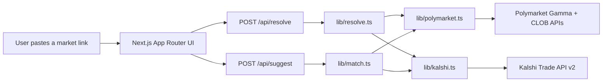

# Parity — a Polymarket ⇄ Kalshi explorer

**Live demo:** [market-explorer-smoky.vercel.app](https://market-explorer-smoky.vercel.app)
**Author:** [Michael Shih](https://github.com/smuushi)

## Why I built this

I'm applying to Polymarket's Software Engineer role on the US Exchange team. I already work at
[ChainPatrol](https://chainpatrol.io), where I'm one of the engineers behind the AI-powered comment
moderation service Polymarket runs today for community trust & safety — so I wanted to send
something that shows the kind of software I'd actually build there, not just talk about it.

Polymarket and Kalshi both run public, unauthenticated market-data APIs, but there's no easy way to
put the same real-world question side by side across both venues. Parity is a small, on-demand
explorer that does exactly that: paste a link, get an instant comparison — in the spirit of an
Etherscan or CoinMarketCap page, but for prediction markets.

## What it does

1. Paste a Polymarket or Kalshi market link.
2. The server resolves it against the platform's public API, normalizing price, volume,
   liquidity, spread, and resolution date into one shared shape.
3. It searches the other platform for the closest matching market by title similarity and
   category, and renders a ranked list of candidates.
4. You get a side-by-side comparison: implied probability gap, volume difference, and how far
   apart the two markets' resolution dates are — plus a 7-day price sparkline for each side.

You can also paste both links directly if you already know the exact pair you want to compare, or
switch between outcomes when a link resolves to a multi-outcome event (e.g. "World Cup Winner").
The comparison always ends with a one-line verdict on which platform offers the better price to
buy Yes, not just a neutral probability gap — the point is to answer "where's the better odds?" at
a glance.

There's also a CLI sibling, [`parity-cli`](https://github.com/smuushi/parity-cli), that exposes the
same resolve/compare/match logic as a scriptable command-line tool with a `--json` mode, built so
an AI agent can shell out to it as easily as a person can run it in a terminal.

## Architecture



All third-party calls happen server-side (Next.js Route Handlers) to avoid CORS issues and add a
short cache window, since both APIs are public and rate-limit-sensitive.

### Matching, honestly

Neither platform's data schema knows about the other. Matching is a two-stage hybrid, not a
guarantee:

1. **Heuristic shortlist (fast, free).** For Kalshi → Polymarket, this uses Polymarket's
   `/public-search` endpoint directly. For Polymarket → Kalshi, Kalshi's API has no free-text
   search, so the app guesses a category from keywords in the source title (e.g. "fed",
   "inflation" → Economics), fetches that category's series, ranks series by title similarity,
   then fetches and ranks the open markets inside the top series. Ranking uses a dependency-free
   Jaccard token-overlap score (`lib/text.ts`) — ratio of shared significant words to total words.
2. **AI re-ranker for ambiguous cases (`lib/ai-match.ts`).** Measured against real examples, a
   genuinely correct cross-platform match usually only scores ~0.2–0.25 on that Jaccard score —
   and a same-topic-but-different-question false positive (e.g. "will X drop out of the race" vs.
   "will X be endorsed", which share every proper noun) can score close behind it. Token overlap
   alone can't reliably tell those apart, so when the top heuristic score falls in that ambiguous
   band, the shortlist is handed to a small model (`gpt-5.4-mini`, OpenAI) that judges which
   candidate (if any) is about the same underlying event — a different date/threshold on an
   otherwise-matching event isn't grounds for rejection (the UI surfaces that gap separately via
   the delta strip), but a different condition, action, or set of people/entities is. Only
   obviously high-confidence matches skip the AI step entirely. If no `OPENAI_API_KEY` is
   configured, or the call fails for any reason, matching falls back to the heuristic ranking
   rather than breaking.

The UI always shows the next-best alternatives too, so you can override the pick either way.

## Tech stack

- **Next.js 16** (App Router, Route Handlers, Turbopack)
- **TypeScript** throughout, **Zod** for runtime validation of every external API response and
  every internal API request/response
- **Tailwind CSS v4** with a small set of hand-rolled shadcn-style primitives (`components/ui/*`)
- **Recharts** for the price-history sparklines
- No database, no auth, no secrets — everything is fetched live from public endpoints

## Data sources

- [Polymarket Gamma API](https://docs.polymarket.com/market-data/overview) —
  `gamma-api.polymarket.com` (events, markets, public search) — public, no auth
- [Polymarket CLOB API](https://docs.polymarket.com/market-data/overview) —
  `clob.polymarket.com` (price history) — public, no auth
- [Kalshi Trade API v2](https://docs.kalshi.com) — `external-api.kalshi.com/trade-api/v2`
  (markets, events, series, candlesticks) — public, no auth for market data

This project is not affiliated with, endorsed by, or built using non-public data from Polymarket or
Kalshi. All data comes from each platform's documented public market-data endpoints.

## Running locally

```bash
npm install
npm run dev
```

Open [http://localhost:3000](http://localhost:3000). No environment variables are required — set
`OPENAI_API_KEY` in `.env.local` to enable the AI re-ranker for ambiguous matches (see
"Matching, honestly" above); without it, matching still works via the heuristic ranking alone.

## Roadmap / out of scope for this MVP

This is deliberately an on-demand tool, not a crawler, to keep the deploy simple (pure Vercel, no
database). The natural next steps if this became a real product:

### Infrastructure — move from on-demand to always-on

- A Cloudflare Worker on a cron trigger that periodically crawls both platforms' trending markets
  into KV or D1, powering a searchable/browsable homepage instead of requiring a pasted link.
- Stored historical snapshots (not just the ~7-day window each API exposes) for longer-range price
  history and volume trend charts.
- Persisted matched pairs, so the heuristic/AI matching cost is paid once per pair instead of once
  per page load.

### Alerts — surface disparities without having to go looking for them

- Automated alerts (email/Discord/webhook) when a tracked pair's probability gap crosses a
  configurable threshold, e.g. "notify me when Polymarket and Kalshi disagree by >5% on this
  question."
- A live "spread" leaderboard: matched pairs ranked by current probability gap, so the biggest
  cross-platform disagreements surface on their own.
- Gap-decay alerts — flag when a large disparity closes quickly, which is itself a signal that one
  platform's price discovery lagged the other's.

### Analysis — go beyond a single snapshot

- Which market "won" — for pairs that both reference the same real-world event with a hard
  resolution moment (a Fed decision, an election call, a game result), compare timestamped price
  history on each side to measure which platform's price moved to reflect the new information
  first, and by how much lead time.
- Comment/discussion comparison — Polymarket and Kalshi both have on-market discussion; surface
  each platform's top comments side by side next to the matched pair, and (longer term) a rough
  sentiment/consensus read of each side's discussion versus its own price.
- Historical accuracy tracking — once a matched pair resolves, record which platform's pre-close
  price was closer to the actual outcome, aggregated over time into a per-platform calibration
  score.
