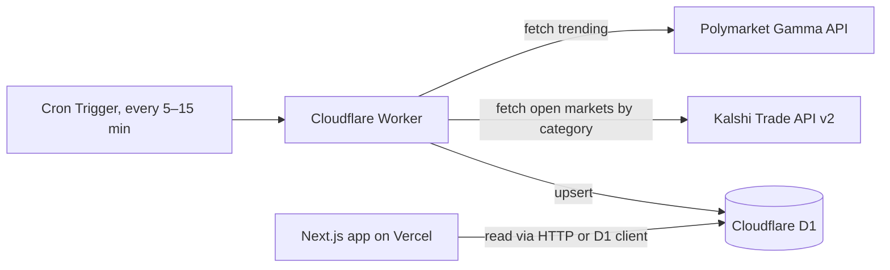

# Always-on crawler (Cloudflare Worker + D1)

## What this is

A scheduled job that periodically pulls trending/open markets from both Polymarket and Kalshi and
stores them, so the site can offer a browsable/searchable homepage of live markets instead of
requiring a pasted link every time. This is the foundational piece — every other roadmap item
(alerts, leaderboards, trend charts, calibration tracking) reads from or writes to the database
this introduces.

## Why

The current app (`lib/resolve.ts`, `lib/match.ts`) is entirely request-driven: nothing is stored,
every comparison re-fetches and re-matches from scratch. That's the right MVP tradeoff (zero infra,
zero cost, zero staleness) but it means there's no way to answer "what are the biggest
disagreements right now?" without a persistent, periodically-refreshed dataset behind it.

## Prerequisites

None — this is the foundation everything else builds on.

## Proposed architecture



The crawler runs as a **separate Cloudflare Worker**, not inside the Next.js app on Vercel —
Vercel Cron Jobs would also work mechanically, but Cloudflare D1 + Workers is what's already
named in the root README's roadmap, and D1's per-query pricing on a hobby project is effectively
free at this scale. Keep the Next.js app on Vercel; only the crawler + database move to
Cloudflare.

### Decision: how does the Next.js app read D1?

Two real options — pick one and note the choice in the PR, don't split the difference:

1. **HTTP API worker.** The same (or a second) Worker exposes a small read-only JSON API
   (`GET /markets/trending`, `GET /markets/:platform/:id`) that the Next.js app calls over
   `fetch()`, same shape as the existing `/api/resolve` and `/api/suggest` routes today.
2. **Direct D1 access via Cloudflare's REST API.** Skip the Worker HTTP layer and have Next.js
   Route Handlers call D1's HTTP API directly with a Cloudflare API token. Fewer moving parts, but
   couples the web app's server code to Cloudflare-specific auth/config instead of a normal HTTP
   contract.

Recommendation: option 1. It keeps the Worker as the single owner of the database (nothing else
needs D1 credentials), and it's a pattern the app already uses internally (Route Handlers as a
thin API in front of business logic).

## Data model (D1 / SQLite)

This schema is shared by every other roadmap doc — treat this as the canonical source, don't
redefine these tables elsewhere.

```sql
-- Latest known state of every market the crawler has seen. Upserted every crawl tick.
CREATE TABLE markets (
  platform TEXT NOT NULL,              -- 'polymarket' | 'kalshi'
  market_id TEXT NOT NULL,             -- platform-native id (Market.id from lib/types.ts)
  title TEXT NOT NULL,
  group_title TEXT,
  option_label TEXT,
  source_url TEXT NOT NULL,
  yes_probability REAL,
  volume REAL,
  volume_24hr REAL,
  liquidity REAL,
  close_date TEXT,                     -- ISO 8601
  status TEXT NOT NULL,                -- MarketStatus from lib/types.ts
  first_seen_at TEXT NOT NULL,         -- ISO 8601
  updated_at TEXT NOT NULL,            -- ISO 8601, last crawl tick that touched this row
  PRIMARY KEY (platform, market_id)
);

CREATE INDEX idx_markets_status ON markets(status);
CREATE INDEX idx_markets_volume ON markets(volume DESC);
```

`markets` intentionally mirrors the shape of `Market` in `src/lib/types.ts` so the crawler can
reuse the exact same normalization functions (`polymarket.ts` / `kalshi.ts`) that already convert
raw API responses into that shape — no second parsing layer needed. See
[infra-02](./infra-02-historical-snapshots.md) for the time-series table and
[infra-03](./infra-03-persisted-matched-pairs.md) for `matched_pairs`.

## Implementation plan

1. **New `worker/` directory** at the repo root (sibling to `src/`), its own `package.json`,
   `wrangler.toml` (cron trigger config, D1 binding), and `src/index.ts` entry point.
2. **Reuse, don't rewrite, the adapters.** `worker/` needs `parsePolymarketUrl`-adjacent "list
   trending/open markets" functions, not URL parsing. Add new exported functions to
   `src/lib/polymarket.ts` / `src/lib/kalshi.ts` (e.g. `fetchTrendingPolymarketMarkets()`,
   `fetchOpenKalshiMarketsByCategory()`) rather than writing separate fetch logic in the Worker,
   then decide how the Worker gets access to them — see "Open questions" below.
3. **Crawl tick logic** (`worker/src/crawl.ts`): fetch N trending Polymarket events + M Kalshi
   categories' open markets, normalize each into `Market` shape, upsert into `markets`, insert a
   row into `market_snapshots` (infra-02) for each.
4. **Cron schedule**: start conservative (every 15 min) — both APIs are public and rate-limited;
   there's no need for near-real-time freshness for a browsable list.
5. **Read API**: `GET /markets/trending?limit=50&sort=volume` and
   `GET /markets/:platform/:id`, returning `Market[]` / `Market` shaped exactly like the existing
   Zod schemas so the Next.js side can validate with `MarketSchema` from `lib/types.ts` unchanged.
6. **Next.js side**: a new Route Handler (e.g. `/api/trending`) proxies to the Worker's read API
   (server-side, so the Worker's URL/token never reaches the browser), and a new homepage section
   or `/browse` page renders it using the existing `MarketPanel`-style components.

## Open questions

- **Code sharing between `src/lib/` and `worker/`.** This would be the *third* place adapter logic
  lives (after the web app and `parity-cli`, both of which already manually duplicate
  `polymarket.ts`/`kalshi.ts`/`text.ts`/`types.ts` — see `AGENTS.md`). Three copies is past the
  point where manual sync is reasonable. Consider converting the repo to npm/pnpm workspaces with
  a shared `packages/core` at this point, with the web app, worker, and (optionally) `parity-cli`
  as consumers. This is a real scope decision — flag it explicitly rather than silently adding a
  third copy-paste.
- **Kalshi has no "trending" endpoint.** Unlike Polymarket's `/events?order=volume`, Kalshi's
  Trade API v2 requires picking series/categories up front (same limitation
  `searchKalshiMarkets` in `lib/kalshi.ts` already works around). The crawler likely needs a
  fixed, curated list of series tickers to poll rather than a true "top trending" query — decide
  and document that list rather than trying to discover it dynamically.
- **Cloudflare account setup.** This introduces a new piece of infrastructure (and likely a new
  Cloudflare account/token) beyond the existing Vercel + GitHub setup — confirm that's still
  wanted before building, given the project's explicit "keep the deploy simple" MVP philosophy.
